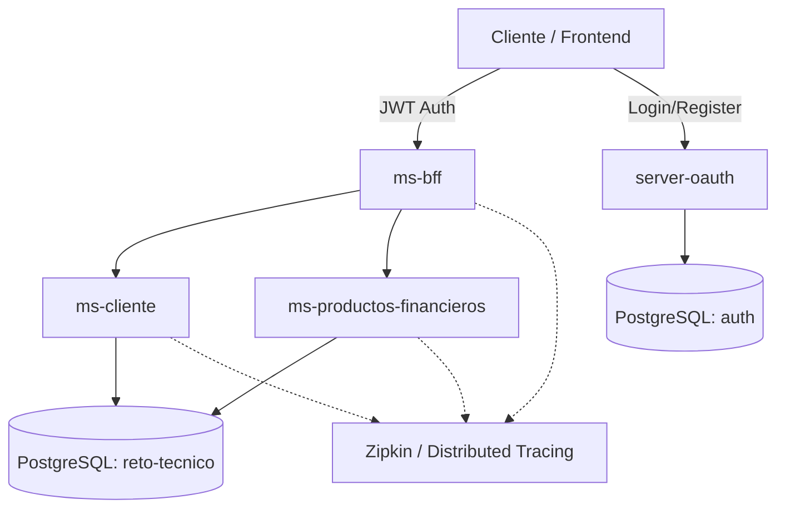

# Sistema de Gestión Microservicios Financieros

[](https://www.oracle.com/java/technologies/javase/jdk17-archive-downloads.html)
[](https://spring.io/projects/spring-boot)
[-blue.svg)](https://projectreactor.io/)

Este proyecto es una arquitectura de microservicios robusta y moderna diseñada para la gestión integral de clientes y sus productos financieros (Cuentas de Ahorro y Tarjetas de Crédito). El sistema implementa patrones de diseño avanzados como **BFF (Backend For Frontend)**, programación reactiva, y seguridad basada en **OAuth2**.

---

## 🏛️ Arquitectura del Sistema

El sistema utiliza una arquitectura distribuida donde cada componente tiene una responsabilidad única y bien definida:



### Componentes Principales

1.  **`server-oauth` (Puerto 9000)**: Servidor de autorización basado en Spring Authorization Server. Gestiona el ciclo de vida de los usuarios, roles y la emisión de tokens JWT.
2.  **`ms-bff` (Puerto 8081)**: Actúa como punto de entrada único para las aplicaciones cliente. Orquestra y agrega datos de múltiples microservicios para optimizar la comunicación del frontend.
3.  **`ms-cliente` (Puerto 8082)**: Gestiona la información demográfica y de usuario de los clientes. Utiliza stack reactivo puro.
4.  **`ms-productos-financieros` (Puerto 8083)**: Administra el catálogo y estado de productos (cuentas y tarjetas).
5.  **`common-exception`**: Librería compartida que estandariza el manejo de errores en todo el ecosistema.

---

## 🚀 Tecnologías y Frameworks

-   **Core**: Java 17, Spring Boot 3.5.10 (Microservicios) y 4.0.1 (OAuth Server).
-   **Reactividad**: Spring WebFlux, Project Reactor.
-   **Persistencia**: R2DBC (Acceso reactivo a base de datos), Spring Data JPA (OAuth Server).
-   **Base de Datos**: PostgreSQL 15+.
-   **Seguridad**: Spring Security OAuth2 (Authorization & Resource Server), JWT.
-   **Documentación**: OpenAPI 3.0, Swagger UI.
-   **Observabilidad**: Micrometer Tracing, Zipkin.
-   **Herramientas**: Maven, Docker, Lombok, MapStruct.

---

## 🛠️ Configuración y Despliegue

### Requisitos Previos
- Docker & Docker Compose
- Java 17
- Maven 3.8+

### Paso 1: Infraestructura de Base de Datos
Levante el contenedor de PostgreSQL que inicializa automáticamente las bases de datos `auth` y `reto-tecnico`:
```bash
docker compose up -d
```

### Paso 2: Instalación de Dependencias Compartidas
Debe instalar localmente la librería de excepciones antes de compilar los microservicios:
```bash
cd common-exception
mvn clean install
cd ..
```

### Paso 3: Compilación y Ejecución
Ejecute los microservicios en el siguiente orden recomendado:

1. **OAuth Server**:
   ```bash
   cd server-oauth && ./mvnw spring-boot:run
   ```
2. **Microservicios de Negocio**:
   ```bash
   cd ms-cliente && ./mvnw spring-boot:run
   cd ms-productos-financieros && ./mvnw spring-boot:run
   ```
3. **BFF**:
   ```bash
   cd ms-bff && ./mvnw spring-boot:run
   ```

---

## 🔐 Seguridad y Flujo de Datos

### Proceso de Autenticación
1. El usuario se registra en `/auth/register` del `server-oauth`.
2. Solicita un token en `/oauth2/token`.
3. El token generado contiene un claim `uuid` encriptado.

### Flujo del BFF (`/api/v1/resumen`)
El BFF implementa una lógica de agregación inteligente:
1. Extrae y desencripta el `uuid` del token JWT.
2. Consulta de forma reactiva al `ms-cliente` usando el `uuid`.
3. Con el ID interno obtenido, consulta al `ms-productos-financieros`.
4. Combina ambas respuestas en un único objeto consolidado.

---

## 📑 Documentación de la API

| Microservicio | Base Path | Swagger UI |
| :--- | :--- | :--- |
| **ms-bff** | `/api/v1/resumen` | N/A (Aggregator) |
| **ms-cliente** | `/api/v1/clientes` | `http://localhost:8082/webjars/swagger-ui/index.html` |
| **ms-productos** | `/api/v1` | `http://localhost:8083/swagger-ui.html` |
| **server-oauth** | `/` | Endpoints de Auth |

### Endpoints Relevantes
- `POST /oauth2/token`: Obtención de Bearer Token.
- `GET /api/v1/resumen`: Resumen consolidado del cliente.
- `GET /api/v1/clientes/usuario/{userId}`: Datos de cliente por ID de usuario.
- `GET /api/v1/cuentas-ahorro/{clienteId}`: Cuentas de ahorro por cliente.

---

## 📡 Trazabilidad Distribuida

El sistema integra **Zipkin** para el rastreo de peticiones. Puede visualizar el flujo de una petición a través de los microservicios accediendo a:
🔗 **[http://localhost:9411](http://localhost:9411)**

Las trazas permiten identificar latencias y fallos en la cadena de llamadas entre el BFF y los servicios de backend.

---
© 2024 Proyecto Reto Técnico - Microservicios Financieros.
